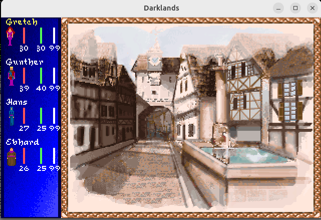
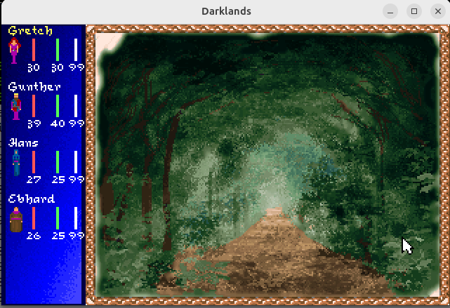
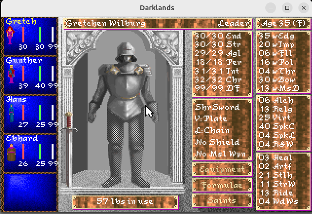
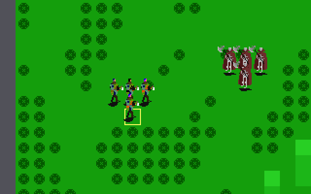

# OpenDarklands (open-source reimplementation)

A modern reimplementation of MicroProse's classic 1992 RPG **Darklands**,
built by reading and interpreting the original game's data files.

The goal is twofold:

1. **Reimplement** the game by parsing the original DOS data directly
   (catalogs, graphics, sounds, locations...) rather than requiring
   pre-converted assets.
2. **Improve** on the original — modern resolutions, quality-of-life
   features, and fixes for long-standing quirks of the 1992 release.

## Status

**Playable, but far from complete.** The party can already live in the
Holy Roman Empire of 1400: walk its cities, travel between them, trade,
pray, get into trouble with the watch and take on a first quest, all
with the rules decoded from the original executable. There is no
character creation yet, no sound, and battles are shown provisionally
from above.

What works so far:

- **Cities**: the party arrives before the walls, passes the gate (or
  climbs the walls, by day or at night) and walks between the streets
  and the city's places: the inn, the square, the market, the churches,
  the cathedral, the monastery, the guilds, the banks, the physician,
  the alchemist, the slum, the docks, a grove. Every card is the game's
  own, with its text, picture and options, by day and by night.
- **Trade**: the guilds' shops, the market's merchants, the pawnshop,
  the stables, the physician and the alchemist buy and sell, with the
  game's rules for stock, quality and prices; the inn keeps the party's
  items.
- **The inn and the church**: meals and nights at the game's price,
  taking up residence (relax, regain strength, pray, work, study with a
  teacher), Mass, confession, donations, the monks' prayers; the saints
  answer (or not) by the game's rules.
- **Trouble**: curfew and the night watch, wanted parties, guards,
  chases through the streets, the dungeon, the magistrate and the
  executioner; thieves in the slum; a shell game at the city's feast.
- **The world**: the map with the game's tiles, travel with the game's
  terrain costs and time, news and rumors drawn from the game's events.
- **A quest**: the banks hire the party against a robber knight; his
  tower can be besieged or the knight challenged, fought and slain, and
  the reward collected (the audience and the inside of the tower are
  not implemented yet).
- **Battles** (provisional, seen from above): the party and the enemies
  on the game's battlefield maps, with their sprites; the game's melee
  rules, wounds, deaths and loot.
- **The party**: the Quickstart characters or a saved game, the
  information screens (F1..F6), the party recovering as time passes;
  **saving** (Ctrl+S) in the original's format.
- **Tools** for the data: browse and export the images (`.PIC`,
  `.CAT`), render the world map, dump the locations, cities, enemies,
  saints, events and cards (see Running below).

Not implemented yet: character creation, the game's own battle
screen, sound, the other quests, and many places' options (they say
"not implemented" when chosen). See the roadmap below.

## Screenshots

-  
- 
- 
- 

## Roadmap

- [x] Parse `.CAT` catalogs and decode `.PIC` images
- [x] Export decoded images (`--extract`)
- [x] Decode enemy palette files (`ENEMYPAL.DAT`)
- [x] Parse and render the world map (`DARKLAND.MAP`)
- [x] Decode the map icon sheets (`MAPICONS.PIC` / `MAPICON2.PIC`,
      PIC files with an embedded palette) for real map graphics
- [x] Solve the map tile column rule (transition/connection variants)
- [x] Parse `DARKLAND.LOC` (`--locations`)
- [x] Decode the game fonts (`FONTS.FNT`) and label cities on the map
- [x] Parse the city descriptions (`DARKLAND.CTY`, `--cities`)
- [x] Parse the enemies (`DARKLAND.ENM`, `--enemies`)
- [x] Decode the battle sprites (`.IMC`, `--extract E00C.CAT <dir>`)
      and pictures (`BATTLEGR.IMG`, `COMMONSP.IMG`)
- [x] Read the battlefield maps (`IMAPS.CAT`, `--battlemap ICITY.000`)
- [ ] Battles: a provisional view of the maps from above (`--battle
      ICITY.000`); the game's own drawing is not decoded yet
- [x] Command-line map export at full resolution (`--map`)
- [x] Interactive world map viewer: scrolling, city names, city details
- [x] Party travel on the map (pathfinding) to the cities and the
      other places
- [x] Parse the menu cards (`MSGFILES`, `--messages`)
- [ ] Decode more resource types (sound archives, ...)
- [x] Show a menu card with its options (`--card`)
- [x] The flow between the city cards (inn, streets, gate) and the map
- [x] The party: characters and saved games, the sidebar
- [x] Saving the game (Ctrl+S), in the original's format
- [x] Game time: the clock, day and night, travel time (the game's own
      terrain costs, decoded from the executable)
- [x] Party and character information screens
- [x] The city places: moving between them, waiting
- [x] Trade with the arms-making guilds (swordsmith, blacksmith,
      armorer, bowyer)
- [x] The city church: Mass, confession, donations (divine favor)
- [x] Trade at the market (everyday goods, foreign traders,
      pharmacists, the Leihhaus)
- [x] The inn: the price of a meal and a night, sleeping, the stables,
      taking up residence (relax, regain strength, pray, work, study),
      leaving items with the innkeeper
- [x] Trade with the artificers' and clothmakers' guilds
- [x] The party recovers as time passes (endurance, divine favor,
      strength), by the game's rules
- [x] The Fugger and Medici banks: letters of credit
- [x] The physician: his skill, treating wounds, alchemical components
- [x] The alchemist's shop: a better philosopher's stone, potions and
      components
- [x] The market at night (sneaking, bribing) and the night watch
      (fines, running away)
- [x] Arriving at a city: the walls, the gate by day and at night
- [x] The watch, the guards, chases, the dungeon, the magistrate and
      the execution
- [x] The saints: calling upon them where the game allows it
- [x] News and rumors, from the game's events
- [x] The robber knight quest: the banks' task, the tower, the reward
- [x] Random encounters in the city: thieves in the slum, the shell
      game
- [x] The monastery: prayers, the library and the abbess (asking)
- [ ] What happens in the other places (training, audiences...), the
      other quests
- [ ] Sound playback
- [ ] Character creation, the game's own battle screen

## Building

The external dependencies are **SDL2** and **zlib** (the latter is used by
libjgame), plus a C++11 compiler, `make` and `pkg-config`.

```sh
git clone --recurse-submodules https://github.com/jackburton79/darklands.git
cd darklands
make
```

If you already cloned without `--recurse-submodules`, fetch libjgame with
`git submodule update --init`.

Installing the dependencies, per platform:

```sh
# Debian/Ubuntu
sudo apt install build-essential pkg-config libsdl2-dev zlib1g-dev

# Fedora
sudo dnf install gcc-c++ make pkgconf-pkg-config SDL2-devel zlib-devel

# Haiku
pkgman install libsdl2_devel zlib_devel
```

## Running

You must supply your own copy of the original game data — this repository
contains none. *Darklands* is available for purchase on GOG.com.

Point the program at the game's data directory (the one containing
`DARKLAND.MAP`, `DARKLAND.LOC`, ... and the `PICS` subdirectory) with
`--data`; the default is `data/DARKLAND` under the working directory.
Game files are looked up by name, in that directory and then in `PICS`:

```sh
# Play, from a random city (--start <city>: from that one).
# Cards: the mouse or the arrow keys to choose an option, click or
# Return to take it, Esc to quit; Ctrl+S (on the map too) saves the game
# as the first free SAVES/DKSAVEn.SAV, which --load reads.
# Map: click to travel there (clicking a city goes there and shows it),
# right click a city for its details, arrow keys (shift: faster) or drag
# to scroll, space to center on the party, Esc to go back or quit
./darklands --data /path/to/DARKLAND
./darklands --start Hamburg
./darklands --load DKSAVE0.SAV

# Browse the images of a catalog (left/right arrow keys)
./darklands EINFO.CAT

# Export every image of a catalog as BMP (the output directory must exist)
./darklands --extract EINFO.CAT out/

# Render the world map, with city names, to <prefix>.bmp (default: map)
./darklands --map [output prefix]

# List the map locations (cities, castles, caves...) with coordinates
./darklands --locations

# List the cities with their rulers, neighbors and places
./darklands --cities

# List the enemy types (attributes, skills) and the enemies
./darklands --enemies
./darklands --saints
./darklands --events

# Print a battlefield map as text (e.g. ICITY.000, IWILDGEN.101)
./darklands --battlemap ICITY.000

# Show a battlefield map from above (provisional; arrow keys, Esc), with
# the party of a saved game and four enemies (their sprite set, e.g. M03);
# 1..5 or a click select a member, a click on a cell sends it there; the
# enemies close in (the space bar stops or starts them) and the figures
# next to a foe fight it, with DARKLAND.EXE's melee rules, until one side
# is down
./darklands --battle IWILDGEN.101 M03 DKSAVE0.SAV

# List the menu card files, or dump the cards of one (e.g. PARTY02)
./darklands --messages [name]

# Show a card of a deck, in a city (default: card 0, in Köln), after a
# scene picture: arrow keys or the mouse to choose an option, Return or
# click to take it, Esc to quit
./darklands --card PARTY02 0 Hamburg
./darklands --card MAINS01 0 Köln MAIN-ST.PIC
```

## Project layout

```
src/darklands.cpp   Program entry point: the game, catalog dump, --extract,
                    --map, --locations, --cities, --enemies, --saints,
                    --events, --messages, --card

src/formats/        Readers for the game's files (no SDL)
  Catalog.*         .CAT archive/catalog files
  PICImage.*        The .PIC image format
  Palette.*         Palette chunk files (ENEMYPAL.DAT)
  FontFile.*        The bitmap fonts (FONTS.FNT, FONTS.UTL)
  MapFile.*         The world map (DARKLAND.MAP)
  LocationFile.*    The map locations (DARKLAND.LOC)
  CityFile.*        The cities (DARKLAND.CTY)
  DescriptionFile.* The city descriptions (DARKLAND.DSC)
  EnemyFile.*       The enemies (DARKLAND.ENM)
  ImcFile.*         The battle sprites (.IMC in E00C.CAT, M00C.CAT...)
  ImgFile.*         The battle pictures (BATTLEGR.IMG, COMMONSP.IMG)
  Sprite.*          The picture format of both
  Lzexe.*           The LZEXE compression of the sprites and battle maps
  BattleMap.*       The battlefield maps (IMAPS.CAT)
  ListFile.*        The item, saint and formula lists (DARKLAND.LST)
  MsgFile.*         The menu cards (.MSG files in MSGFILES)
  CharacterFile.*   The new game's characters (CHARACTR.TMP)
  SaveFile.*        The saved games (SAVES/*.SAV): reading and writing
  EventFile.*       The game's events (EVENTS.TMP, and in the saved games)
  ExeData.*         Names and tables read from DARKLAND.EXE

src/game/           Game state and rules (no screen)
  GameData.*        Access to the game's data files from one data directory
  Character.*       A character (554-byte records) and the party
  GameTime.*        The game's date and time (monastic hours, Julian calendar)
  Travel.*          Paths across the world map
  BattlePath.*      Paths across a battlefield map
  Combat.*          Melee strikes, as DARKLAND.EXE resolves them

src/ui/             Screens and drawing
  Game.*            The game: new or loaded, cities and the world map in turn
  CityVisit.*       The party in a city: which card follows which
  CardView.*        A menu card on screen: frame, text, options
  InfoView.*        The party and character information screens
  PartySidebar.*    The character boxes on the left of the screens
  TradeView.*       Buying and selling with a merchant
  BattleView.*      A provisional view of a battlefield, from above
  ResidenceView.*   Living at the inn: the members' activities
  MapViewer.*       Interactive world map (scrolling, travel, city details)
  WorldMap.*        The world map: tiles, column rule, drawing any part of it
  CityLabels.*      City names drawn over the map
  ScreenSupport.*   The game window and mouse cursor, for the screens
  TextSupport.*     Text rendering with the game fonts

docs/formats.md   Reverse-engineered data format notes
docs/exe.md       Notes on DARKLAND.EXE: structure, decoded rules
```

The repository also uses, as a git submodule, [libjgame](https://github.com/jackburton79/libjgame), a game library by the same author
that provides streams, graphics, and audio support (it has its own README
and license). It is built automatically by the top-level Makefile.

## Documentation

Reverse-engineered data format notes live in [docs/formats.md](docs/formats.md).

## Legal

This project contains no original game assets or code. It is an independent
reimplementation that reads data files from a copy of the game the user must
own. *Darklands* is a trademark of its respective owners; this project is not
affiliated with or endorsed by them.

## Acknowledgments

- MicroProse, for one of the most atmospheric RPGs ever made
- The Darklands fan community, for reverse-engineering efforts and
  documentation of the data formats
